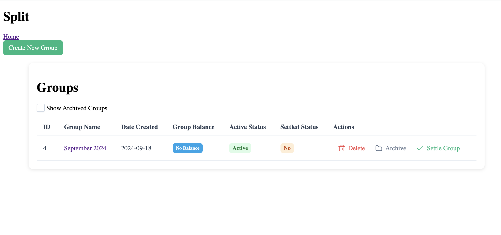
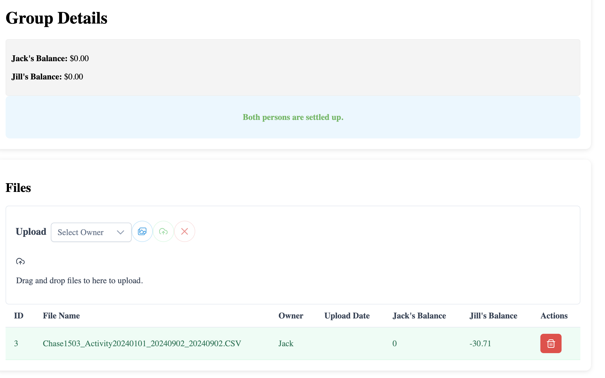
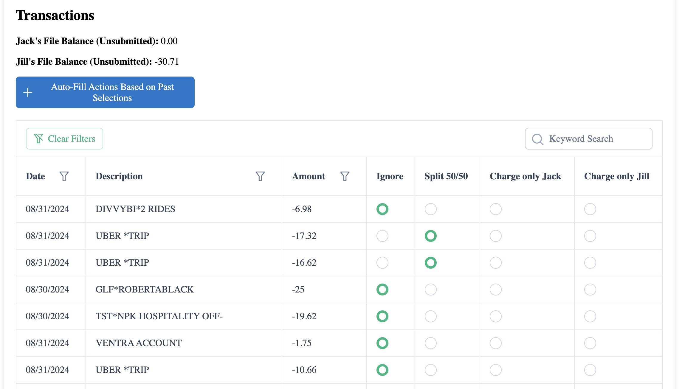

# Split App (Frontend)

## Description
This is a personal project that I built to help my partner and I managed and track expenses. We do not currently have a joint bank account and so we try to split expenses evenly.

Previously, every couple months we would sit down and go through all of our credit card transactions and input the relevant charges into Splitwise or Venmo Groups and pay each other the difference. This was a tedious process that we dreaded.

 Here comes Split: I can locally host the app so we can both work off of our laptops in the same group (e.g. Sept 2024). Each of us can upload our credit card transaction files and quickly mark each transaction if it should be split with the other person.

 Once we have completed going through the transactions, the app will calculate the difference and indicate who owes who. 

 Overall, this process is much less painful.

 Furthermore, once transactions are in the database, there is a feature to "Auto-fill transaction actions based on past selections". So things that have the same description (like utilities) will automatically be split.

## UI Examples
The UI is not great, but it's functional. There are some minor issues with the UI, but the calculations are accurate.

### Homepage to set up groups


### Group Details to upload files


### File Transactions


## Setup

Make sure to install the dependencies:

```bash
# npm
npm install

# pnpm
pnpm install

# yarn
yarn install

# bun
bun install
```

## Development Server

Start the development server on `http://localhost:3000`:

```bash
# npm
npm run dev

# pnpm
pnpm run dev

# yarn
yarn dev

# bun
bun run dev
```

## Production

Build the application for production:

```bash
# npm
npm run build

# pnpm
pnpm run build

# yarn
yarn build

# bun
bun run build
```

Locally preview production build:

```bash
# npm
npm run preview

# pnpm
pnpm run preview

# yarn
yarn preview

# bun
bun run preview
```

Check out the [deployment documentation](https://nuxt.com/docs/getting-started/deployment) for more information.


Run locally on network:

```bash
# npm
npm run dev -- --host
```
